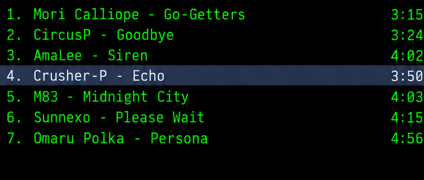
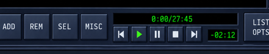

# AmpX UI Visual Checks

## Revision 5 correction — Step 1 (2026-09-12)

**Current visual status: NOT ACCEPTED.** The V1 measurement table and visual-pass verdict below are preserved as historical evidence, superseded by the rejected `screenshots/ampx_v1.png` result and Revision 5. A historical test pass or screenshot list does not satisfy the new visual gates. EQ/Playlist V1 measurements remain unvalidated.

**Authoritative Player measurements:** [ReferenceMeasurementsV2, annotated source](reference-crops/v2/player-measurements-v2.md) · [machine-readable ledger](reference-crops/v2/player-measurements-v2.json).

**Baseline:** existing `.worktrees/ampx-ui`, branch `feature/ampx-ui`, revision `9f3ba45` (completed AppKit cutover). No tracked source edits existed at task start. Untracked files were the old plan/spec/review/PDF and three Playlist reference crops; they were retained. Revision 5 and the corrected plan were carried from the main checkout before measurement work. Main checkout `5dc5a23` is not the implementation baseline.

**Baseline verification:** `./scripts/run-tests.sh` succeeded. The xcresult summary confirms 468 passed tests, zero failures and zero skipped (the console printed 467 case lines). Log: `/tmp/ampx-step1-baseline.log`. Result bundle: `/Users/santiagorodriguez/Library/Developer/Xcode/DerivedData/AmpX-deeoonschstsamebrcjyfpxsbbix/Logs/Test/Test-AmpX-2026.09.12_16-44-27--0300.xcresult`. This establishes behavioral baseline only, not visual fidelity.

**Measurement checkpoint:** Eight grouped annotations (frame, header, display, timer, metadata, sliders, transport, glyphs), the material enlargement sheet, and spectrum scan were opened and visually inspected against the original PNG. The 68 rectangles identify visible edge/ink bounds with ±2 source-pixel uncertainty. Font metrics and invisible interaction bounds are explicitly not measured from raster ink. Derived travel proposals are labeled separately and must be checked during Step 2.

**Corrections established:** actual panel/content origins; centered title and paired header lines; independent timer/play-glyph regions; metadata channel labels outside numeric wells; separate narrow slider tracks and taller metallic handles; recessed seek well and broad gold handle; individual transport widths and 84 pt Shuffle; actual spectrum scans without the former canonical override. JSON also records six per-pixel material edge profiles and twelve color patches.

**Artifact verification:** Regeneration into `/tmp/ampx-reference-v2-repro` produced byte-identical artifacts (`diff -qr`). All 68 unique source-to-logical conversions and annotation links passed validation.

**Scope:** only measurement tooling and documentation changed. No production Swift rendering, model bindings, or saved layout changed. Step 2 and the Player approval gate have not started.

## Revision 5 correction — Step 2: static Player reconstruction (2026-09-12)

**Player approval gate: APPROVED 2026-09-12.** After reviewing the side-by-side below (build `8a618e1`, capture `correction-shots/player-static.png`, scale 1.0 at 2× backing) and the five listed deviations, the user instructed "go with step 3". This is recorded as explicit approval of this concrete Player result including deviations 1–5 below. Overall visual acceptance remains open until EQ/Playlist and later stages pass.

**Baseline:** `.worktrees/ampx-ui`, `feature/ampx-ui` at `7bb9ffc` (Step 1). A previous agent had started Step 2 with uncommitted V2 metric edits and a one-test stub; that work was reviewed and carried forward (its `playerTimer`/`playerPlayGlyph` values were already content coordinates but were still offset by the display well — corrected).

**Capture method:** `AmpXReferenceRenderingTests.testPlayerStaticReferenceCaptureIsDeterministic` hosts the real `AmpXModuleView` + `PlayerModuleContent` (production `draw` methods) in a retained borderless window at scale 1.0, sets `PlayerModuleContent.referencePresentation` (display-only fixture owned by the test; `nil` = live state; no audio/EQ/playlist/layout writes), and renders into a 980 × 447 px (2×) `NSBitmapImageRep` converted to sRGB. Two captures are byte-identical PNGs. The test host writes to the app container tmp directory (sandbox); the file is copied into this repository.

| Evidence | Path |
|---|---|
| Result capture (2×) | [correction-shots/player-static.png](correction-shots/player-static.png) |
| Reference crop, same panel bounds `(10,7,980,447)` px | [correction-shots/player-reference.png](correction-shots/player-reference.png) |
| Side-by-side (reference top) | [correction-shots/player-side-by-side.png](correction-shots/player-side-by-side.png) |
| 50 % overlay | [correction-shots/player-overlay-50.png](correction-shots/player-overlay-50.png) |

Regenerate: `cd scripts && uv run python measure_reference.py ../screenshots/AmpX.png --compare <player-static.png>` (refuses mismatched sizes; never stretches).

**Inspection:** header/title, frame edges, wells, typography, timer, metadata, tracks/thumbs, indicators, spectrum, transport faces and glyphs were inspected individually at 2–3× nearest-neighbor zoom against the reference over three correction iterations (typography weight/size, slider remainder, L/R color, peak placement, timer stroke, header pulse glyph re-traced pixel by pixel).

**Structural corrections:**

- Header: left pulse glyph, paired gold rules around a centered `AmpX` brand, raised 20 pt buttons in reference order (minimize, collapse, close). Previously the drawn glyph order was reversed relative to the hit frames (clicking the visible `—` closed the window); drawing and hit testing now share `headerButtonLayout()`.
- Materials: layered module panel and recessed content frame (shared by all modules via `AmpXModuleView`), raised button faces with sampled highlight/shadow bands, pressed face for Play while playing, orange menu face, recessed wells with steel lip, dotted display grid, pill tracks with steel thumbs, recessed seek well with bevelled gold thumb.
- Sliders: visible track, thumb size and travel are separate from interaction bounds (hit area still expands to 44 pt). Drawing and pointer mapping use the same travel; value/range/`setValue(_:sendChange:)`/`onChange`/accessibility preserved.
- Typography: baseline-positioned Roboto Mono fitted to V2 ink (title 13.75, readouts 14.5 shrink-to-fit, units 12.5, EQ/PL 13.5, SHUFFLE 12.5, L/R 19 semibold, brand 20 semibold). Font smoothing disabled so layer and offscreen rendering match. Metadata never wraps; `mono`/`stereo` right-aligned to reference ink.
- Timer: fixed 14.5 × 25 pt cells, 1.5 pt gap, 18 pt colon slot, right-aligned so `0:04` and `01:51` share cell geometry; remaining-time sign fits left without reaching the play glyph.
- Spectrum: 16 columns × 6 segments at measured pitch, sampled bottom-to-top colors, partial top segments, peak dashes; model counts come from metrics.
- Transport: individual measured widths, per-glyph ink rectangles, Shuffle indicator + label.

**Logic regressions — failing before / passing after** (`AmpXReferenceRenderingTests`). Geometry was first exposed behind the new APIs with unchanged behavior, the tests run, then the fixes applied.

| Test | Before (`Test-AmpX-2026.09.12_17-29-04--0300.xcresult`) | After |
|---|---|---|
| `testChannelLabelsDoNotIntersectNumericOrUnitLabels` | failed (kbps overlapped bitrate; `stereo` wider than its 28 pt rect → wrap) | passed |
| `testDigitCellWidthIsStableAcrossTimeFormats` | failed (cells stretched to fill the rect) | passed |
| `testPointerAtThumbCenterMapsToDisplayedValue` | failed (pointer mapped over full bounds, drawing over inset travel) | passed |
| `testShortButtonTextHasPositiveUsableHeight` | failed (0 pt label height at 20.5 pt button) | passed |
| `testSliderArtworkIsUnchangedWhenOnlyHitBoundsEnlarge` | failed (track/thumb scaled with frame) | passed |
| `testHeaderButtonsFollowReferenceOrder` | passed (hit frames were right; drawn order was the defect) | passed |
| `testAdjacentTransportFacesDoNotIntersect` | passed with V2 metrics (V1 faces overlapped: 14.5–58.5 vs 57.0) | passed |
| `testPlayerStaticReferenceCaptureIsDeterministic` | — (new) | passed |

**Verification:** focused `AmpXReferenceRenderingTests`, `AmpXControlsTests`, `AmpXLayoutTests`, `AmpXPlayerBindingTests`, `AmpXEQBindingTests`, `AmpXAccessibilityTests` → 53 passed after formatting. Full `./scripts/run-tests.sh` → `** TEST SUCCEEDED **`, 476 passed (468 baseline + 8 new), `Test-AmpX-2026.09.12_18-01-00--0300.xcresult`. SwiftFormat applied to changed files; SwiftLint reports 0 warnings in changed files.

**Remaining deviations requiring user decision (not self-approved):**

1. **Glyph proportions.** Reference labels are ~25–35 % narrower relative to their height than Roboto Mono (spec-mandated). Sizes split the difference: widths run up to ~2 pt wider and cap heights ~1–2 pt shorter than reference ink (most visible on `kbps`, `mono`, `stereo`, `SHUFFLE`, `EQ`).
2. **Slider remainder.** The reference shows a tinted run past each thumb of inconsistent length (≈5 pt volume, ≈13 pt balance) with no model meaning; rendered as a fixed 18.75 pt tinted run from the thumb center, then an unfilled remainder.
3. **Spectrum peaks.** Reference peak dashes sometimes sit in inter-segment gaps and some columns show two; rendered as one dash at the top of the peak segment.
4. **Colors.** Text uses spec tokens (`green` #00FF32, `text`) rather than the slightly different sampled values (#05F50A, #F7F9FC).
5. **Pulse glyph.** Re-traced from source pixels; stroke joins differ slightly at 2×.

**Incidental effects (shared primitives, per plan):** EQ/Playlist/ENTHEA now render inside the shared panel/content frame and new header (uppercase `AmpX EQUALIZER` / `AmpX PLAYLIST`, two buttons), with the new raised faces and wells; their content-level panel fills were removed so the frame is visible. `headerHeight` 28.5 pt reduces the default Playlist viewport from 180 to 173.5 pt. Their reconstruction waits for the gate. The display play glyph now indicates playing (it previously showed while stopped), matching the reference.

## Revision 5 correction — Step 3: Equalizer composition (2026-09-12)

**Current visual status: EQ implemented; deviations below await explicit user approval.** Player approval (build `8a618e1`) is preserved: the Player capture after all Step 3 changes is pixel-identical to the approved `correction-shots/player-static.png`.

**Measurements:** [ReferenceMeasurementsV2 — Equalizer](reference-crops/v2/eq-measurements-v2.md) · [JSON](reference-crops/v2/eq-measurements-v2.json), generated by `cd scripts && uv run python measure_reference.py ../screenshots/AmpX.png --module eq`. 50 landmarks from thresholded component scans (header brand/title/rules/glyphs, ON/AUTO/PRESETS faces, lamps, labels and triangle, curve grid/knots, preamp and band slots/thumbs, ±12/0 dB ticks and labels, band labels); seven annotated groups inspected. EQ panel `(10,466,980,451)` px = 490 × 225.5 pt, 6 pt below the Player; content origin `(10,523)` with the shared 28.5 pt header. Reference gains are derived from measured thumb centers on the measured travel (+12 dB center at content y 58.5, −12 dB at 157.25).

**Capture:** `AmpXReferenceRenderingTests.testEqualizerStaticReferenceCaptureIsDeterministic` hosts the real `AmpXModuleView` + `EqualizerModuleContent` with `EqualizerReferencePresentation` (display-only; EQ settings use an isolated `UserDefaults` suite and no audio/EQ setters run). Byte-identical double captures at 980 × 451 px (2×).

| Evidence | Path |
|---|---|
| Result (reference gains) | [correction-shots/eq-static.png](correction-shots/eq-static.png) |
| Reference crop / side-by-side / 50 % overlay | [eq-reference](correction-shots/eq-reference.png) · [eq-side-by-side](correction-shots/eq-side-by-side.png) · [eq-overlay-50](correction-shots/eq-overlay-50.png) |
| Handles at −12 / 0 / +12 dB (ON off, AUTO on) | [eq-min](correction-shots/eq-min.png) · [eq-zero](correction-shots/eq-zero.png) · [eq-max](correction-shots/eq-max.png) |

**Reconstruction:** shared header with measured `AmpX EQUALIZER` placement (brand 18 pt semibold, title 14.5 pt, rules sized from glyph ink); raised ON/AUTO/PRESETS faces with measured lamps (lit green square, unlit round steel dome), baseline-fitted labels and dropdown triangle; curve drawn on the panel (no well) over grid lines at the knots, gold 1.5 pt stroke with knot dots, band knots at the measured 18.39 pt pitch using `AmpXEQBands.responseCurvePoints` + `CatmullRomSpline`; eleven vertical level sliders (preamp separate) at measured centers with 13 pt slots, gain-tinted bars and 20 × 24 pt steel handles with two grooves; ±12/0 dB dashes at the travel rows, slot end marks, yellow dB labels, white band labels centered on bands. Track colors after correction match the reference within ~10 per channel on 9 of 11 tracks. Handle travel is shared by drawing and pointer mapping (`AmpXSlider.travelLength`).

**Logic regression — failing before / passing after:** `testEqualizerTopRowControlsDoNotOverlapCurve` failed on the V1 geometry (curve well x 68–382 overlapped AUTO 43–75 and PRESETS 418–472; `Test-AmpX-2026.09.12_18-17-53--0300.xcresult`) and passes after. `testEqualizerSlidersLabelsAndThumbsStaySeparate` (thumbs at −12/0/+12 stay in content, clear of top-row controls and labels, pointer-at-thumb maps back to the value; artwork never overlaps) passed before and after.

**Verification:** full `./scripts/run-tests.sh` after formatting → `** TEST SUCCEEDED **`, 479 passed (476 + 3 new EQ tests), `Test-AmpX-2026.09.12_18-29-10--0300.xcresult`; this includes `AmpXEQBindingTests`, `AmpXControlsTests`, `AmpXAccessibilityTests` and `AmpXReferenceRenderingTests`. SwiftFormat (repo config, `--self insert`) applied to the Step 3 Swift files; SwiftLint reports 0 violations in them. Post-format captures of Player, EQ reference, −12, 0 and +12 are pixel-identical to the committed correction shots.

**Correction to Step 2 record:** Step 2 stated that SwiftFormat was applied. It was not: the command passed the file list as one zsh argument and SwiftFormat reported "File not found". Step 3 formatted the files it touched, and the remaining Step 2 Swift files are formatted in a separate style-only commit; that behavior-neutral change is verified by an unchanged Player capture.

**Remaining EQ deviations requiring user decision:**

1. **Curve shape.** The reference curve is inconsistent with its own thumbs (e.g. 60 Hz thumb +1.8 dB while its knot rises ~4 pt; 170 Hz near 0 dB but raised). The curve is computed from the gains, so its shape is flatter than the reference.
2. **Stray grid line.** The reference has a 13th grid line at x 196 pt that matches no knot; it is not drawn.
3. **Track colors.** The reference hue is not a consistent function of gain; a fitted gain→color ramp is used. 170 Hz renders yellow instead of yellow-green, 1 kHz green at the top instead of yellow, and bottom green tints on 170/6K are weaker.
4. **Scale geometry.** Linear travel between the measured ±12 dB ticks puts the 0 dB dash at 108.25 pt (reference 106.5 pt), and the reference's displaced 0 dB dashes near some thumbs are drawn straight.
5. **Header offset.** Reference EQ header elements and content frame sit 0.5–1.5 pt lower than the Player's; the shared header geometry is kept. The reference's third (minimize) EQ header button is omitted per the spec.
6. **Glyph proportions.** As approved for the Player: Roboto Mono labels are wider and shorter than the reference lettering (`EQUALIZER`, `PRESETS`, dB and band labels).

**Incidental:** Playlist/ENTHEA headers now use ink-based title placement (Playlist estimated from the full reference, unvalidated until Task 4). Unlit indicator lamps everywhere render as the round steel dome (not visible in the approved Player reference state).

**Not verified in this step:** live-window capture — `./scripts/shoot.sh` built and launched the app but `screencapture` failed ("could not create image from window"), so no live screenshot was taken. Module content still does not scale with UI scale ≠ 1.0 (pre-existing; header and frame do scale) — Task 5 scale checks. 1×/3× backing not captured.

---

## Historical V1 evidence — superseded visual verdict

# AmpX UI Visual Checks — ReferenceMeasurementsV1

**Date:** 2026-09-11  
**Source:** `screenshots/AmpX.png` (998×1576 px, 2× retina; logical canvas 499×788 pt, composition 490 pt wide)  
**Tooling:** `cd scripts && uv run python measure_reference.py ../screenshots/AmpX.png`

All content rectangles are in module-local coordinates (origin below the 22 pt header, excluding outer canvas padding). Source-pixel columns are PNG-space (2×) before logical conversion.

## Stack geometry

| Key | Source px (x, y, w, h) | Logical value | Notes |
|---|---|---|---|
| `compositionWidth` | — | 490 | Module column width at scale 1.0 |
| `canvasPadding.left` | x=9 | 4.5 | `(499 − 490) / 2` |
| `canvasPadding.top` | y=22 | 11 | `(788 − 766) / 2` |
| `headerHeight` | 44 | 22 | Gold accent line at ~10.5 pt from module top |
| `moduleGap` | 12 | 6 | Between Player, Equalizer, Playlist |
| `playerHeight` | 447 | 223.5 | Module outer height |
| `equalizerHeight` | 451 | 225.5 | Module outer height |
| `playlistHeight` | 610 | 305 | Module outer height |
| `playlistNonRowChrome` | — | 103 | Header offset + footer; viewport = 180 pt |

## Player (`player.*`)

| Key | Source px (x, y, w, h) | Content rect (x, y, w, h) | Notes |
|---|---|---|---|
| `player.displayWell` | (39, 87, 331, 184) | (15.0, 10.5, 165.5, 92.0) | Timer + spectrum column |
| `player.timer` | (81, 102, 258, 47) | (36.0, 18.0, 129.0, 23.5) | 7-segment timer within display well |
| `player.playGlyph` | (81, 107, 25, 33) | (21.0, 20.5, 12.5, 16.5) | Green play triangle left of timer |
| `player.trackWell` | (388, 88, 571, 56) | (189.5, 11.0, 285.5, 28.0) | Title marquee well |
| `player.metadata` | (388, 159, 233, 43) | (189.5, 46.5, 116.5, 21.5) | kbps / kHz / mono / stereo — see crop below |
| `player.metadata.digitStyle` | — | **mono** | Continuous Roboto Mono glyphs (see justification) |
| `player.volume` | (387, 229, 201, 41) | (189.0, 81.5, 100.5, 20.5) | Volume slider track |
| `player.balance` | (619, 229, 122, 41) | (305.0, 81.5, 61.0, 20.5) | Balance slider track |
| `player.position` | (40, 289, 917, 8) | (15.5, 111.5, 458.5, 4.0) | Full-width seek bar |
| `player.transport[0…8]` | See script output | See `AmpXMetrics.playerTransport` | prev, play, pause, stop, next, eject, shuffle, repeat, menu — 44×38 pt |

### Metadata reference crop


**Digit style justification (`mono` vs `segments`):** The crop shows kbps/kHz/mono labels drawn with continuous monospace font strokes (curved `9`, open `4`, diagonal `k`). The timer in `player.displayWell` uses discrete 7-segment LED bars (horizontal/vertical chunks with dark gutters). Metadata therefore uses `metadataDigitStyle = .mono`; only the timer and spectrum bars stay segment-drawn.

## Equalizer (`eq.*`)

| Key | Source px (x, y, w, h) | Content rect (x, y, w, h) | Notes |
|---|---|---|---|
| `eq.curve` | — | (68.0, 18.0, 314.0, 24.0) | Black well + dotted midline + gradient spline |
| `eq.onToggle` | — | (15.0, 14.0, 26.0, 18.0) | Green indicator active |
| `eq.autoToggle` | — | (43.0, 14.0, 32.0, 18.0) | Gray indicator inactive |
| `eq.presets` | — | (418.0, 14.0, 54.0, 18.0) | Static silhouette |
| `eq.preamp` | — | (15.0, 56.0, 18.0, 120.0) | Vertical track + thumb at 0 dB |
| `eq.bandRow` | — | (34.0, 56.0, 440.0, 120.0) | Ten evenly spaced band tracks |

### EQ reference crop


**Mock band values (`mockBands`, normalized −1…1):** `[0.333, 0.583, 0.167, -0.167, -0.5, -0.583, -0.083, 0.417, 0.667, 0.75]` — derived from reference PNG thumb positions; display-only, not audio settings. Preamp mock = `0.0`. Curve drawn via `AmpXEQBands.responseCurvePoints` + `CatmullRomSpline.path(…).cgPath` translated into `eq.curve` origin.

## Playlist (`playlist.*`)

| Key | Source px (x, y, w, h) | Content rect (x, y, w, h) | Notes |
|---|---|---|---|
| `playlist.rows` | — | (15.5, 9.5, 424.0, 180.0) | Black row viewport |
| `playlist.scrollbar` | — | (440.5, 9.5, 16.0, 180.0) | Amber arrows + gold thumb |
| `playlist.footer` | — | (15.5, 193.5, 441.0, 89.5) | ADD/REM/SEL/MISC + mini transport |
| `playlist.rowHeight` | — | 22 | Fixed row pitch |
| `playlist.durationColumnWidth` | — | 42 | Right-aligned durations |

### Playlist reference crops





**Mock tracks (display-only):** seven reference rows; index 4 (`Crusher-P - Echo`) selected with flat `selection` fill and `text` color. Row origins use `playlistRows.minY + 22 * index` (never distributed). Durations sit in the 42 pt right column.

**Footer rects (footer-local):** ADD `(0,25,35×40.5)`, REM `(41,25,40.5×40.5)`, SEL `(87,24.5,41×41)`, MISC `(133,25,43×40.5)`, time well `(186,22,203×18.5)` → `0:00/27:45`, mini transport five 23–24 pt buttons at y≈45, remaining `(341,49,48×18)` → `-02:12`, LIST OPTS `(399.5,21,41.5×47.5)`.

**Scrollbar:** 8 pt amber arrow caps; gold thumb `(2,18,12×12)` within `playlistScrollbar`.

## Palette & spectrum

| Key | Value | Source sample | Notes |
|---|---|---|---|
| `gold` | `srgb(0.749, 0.627, 0.322)` | Playlist scrollbar thumb | |
| `goldLight` | `srgb(1.0, 0.953, 0.286)` | Thumb highlight | |
| `spectrum.segmentHeight` | 3.0 pt | L/R analyzer columns | **Frozen override** — PNG median lit run ≈ 2.2 pt (anti-aliased mock peaks); keep Winamp-canonical 3.0 pt |
| `spectrum.segmentGap` | 1.0 pt | L/R analyzer columns below timer | Measured from left analyzer columns (median 2 src px = 1.0 pt) |

### Measurement reconciliation

| Key | Script (raw) | Frozen (`AmpXMetrics`) | Resolution |
|---|---|---|---|
| `player.metadata` | (189.5, 46.5, 116.5, 21.5) | same | Fixed: union bbox of kbps/kHz/mono black wells (`blacks[2]` ∪ `blacks[3]`) |
| `spectrum.segmentGap` | 1.0 pt | 1.0 pt | Fixed: scan L/R columns below timer, not center timer digits |
| `spectrum.segmentHeight` | ~2.2 pt | 3.0 pt | Intentional override — see table above; script prints override to stderr |

## Composition checkpoints (Tasks 6A–6C)

- [x] Task 6A: Player crop — wells, timer segments, mono metadata, transport silhouettes
- [x] Task 6B: Equalizer crop — curve well, preamp, ten band tracks, mock curve
- [x] Task 6C: Full three-module stack at scale 1.0 and scale bounds

Capture: `./scripts/shoot.sh` (default stack width 490 pt; resize stack to 416.5 pt / 661.5 pt content width → scale 0.85 / 1.35). Detached/collapsed states restored via `defaults import com.ampx.macos` with `AmpXModuleLayoutV1` JSON before relaunch.

**Remaining deltas vs PNG (honest):** scrollbar gold is subtle in `AmpX.png` (mock uses sampled palette); row selection blue differs slightly from PNG anti-alias; footer bevel depth is approximate; module header gold accent sits on the bevel seam rather than the PNG's inset line.

---

## Task 20 — AppKit acceptance verification (2026-09-12)

**Build:** `a290baf53520f94b489f5c3a506ca55e784411c0`  
**Toolchain:** Xcode 26.4 (17E192) · macOS 26.6.2 (25G83) · arm64  
**Physical display:** `NSScreen.main` backing scale **2.0** (2056×1329 pt). No 3× display available in this environment.

### Full regression suite (final tree)

```text
./scripts/run-tests.sh
→ ** TEST SUCCEEDED **
→ 468 tests passed, 0 failed (73 suites)
→ xcresult: ~/Library/Developer/Xcode/DerivedData/AmpX-deeoonschstsamebrcjyfpxsbbix/Logs/Test/Test-AmpX-2026.09.12_01-38-47--0300.xcresult
```

Key UI suites exercised: `AmpXLayoutTests`, `AmpXStackViewportTests`, `AmpXHostCoordinatorTests`, `AmpXLayoutStoreTests`, `AmpXTheaterTests`, `AmpXAccessibilityTests`, `AmpXKeyRouterTests`, `AmpXEffectiveVisibilityTests`, `AmpXPlayerBindingTests`, `AmpXEQBindingTests`, `PlaylistKeyboardAdapterTests`, `EntheaHostLifecycleTests`, `AmpXPixelGridTests`, `AmpXFontsTests`.

### Backing-scale coverage

| Scale | Evidence | Limitation |
|---|---|---|
| 1× | Live stack screenshots at logical widths below | Rendered on 2× display; geometry uses `AmpXPixelGrid` 1× rules |
| 2× | Primary capture environment (backing 2.0) | — |
| 3× | `AmpXPixelGridTests.testStrokeRectEdgesAt3x`, `testAlignAt1xAnd3x` | **Offscreen only** — no 3× monitor attached |

### Window sizes exercised

| Scenario | Stack frame (w×h) | Derived scale | Screenshot |
|---|---|---|---|
| Scale 0.85 expanded | 417×900 | 0.85 | [scale-0.85-expanded](acceptance-shots/scale-0.85-expanded.png) |
| Scale 1.0 expanded | 490×600 (default) / 490×900 | 1.0 | [scale-1.0-expanded](acceptance-shots/scale-1.0-expanded.png) |
| Scale 1.35 expanded | 662×900 | 1.35 | [scale-1.35-expanded](acceptance-shots/scale-1.35-expanded.png) |
| Collapsed EQ | 490×700, `collapsed: [equalizer]` | 1.0 | [scale-1.0-collapsed-eq](acceptance-shots/scale-1.0-collapsed-eq.png) |
| Detached Playlist | stack 490×520 + detached 490×380 | 1.0 / inherited | [stack](acceptance-shots/detached-playlist-stack.png) · [window](acceptance-shots/detached-playlist-window.png) |
| Detached EQ | stack 490×420 + detached 490×280 | 1.0 / inherited | [stack](acceptance-shots/detached-eq-stack.png) · [window](acceptance-shots/detached-eq-window.png) |
| All-four overflow | 662×480, all modules open | 1.35 | [all-four-overflow-1.35](acceptance-shots/all-four-overflow-1.35.png) |

Hit-area alignment after resize: stack width maps to `AmpXLayout.scale(width:)` (clamped 0.85–1.35); module frames and control rects scale with layout (`AmpXLayoutTests`). Live interactive resize was not exercised — scale bounds verified via layout-import screenshots and unit tests only.

### PNG comparison — accepted deltas

Compared panel bounds to `screenshots/AmpX.png` / reference crops above:

- **Header/padding:** 4.5 pt canvas side inset and 11 pt top inset preserved; gold accent on header bevel (not PNG's inner well line).
- **Typography:** `AmpXFonts.register()` loads Roboto Mono (Regular/Medium/SemiBold). Missing-glyph path falls back to `NSFont.monospacedSystemFont` (`AmpXFontsTests`).
- **Timer vs metadata:** 7-segment timer + 3 pt spectrum segments; metadata uses continuous mono glyphs (per crop justification).
- **Spectrum:** 3.0 pt segment height override (intentional).
- **Selection/footer:** playlist selection blue and footer bevel depth differ slightly from PNG anti-alias.

### Spec acceptance table

| Area | Result | Evidence |
|---|---|---|
| Visual fidelity | **Pass** | Scale shots above; `AmpXPixelGridTests` (1×/2×/3× offscreen); `AmpXFontsTests` |
| Layout and scale | **Pass** | `AmpXLayoutTests`, `AmpXStackViewportTests`, screenshots at bounds |
| Module state and persistence | **Pass** | `AmpXModuleOrderTests`, `AmpXLayoutStoreTests`, `AmpXHostCoordinatorTests`; layout import round-trip |
| Overflow | **Pass** | `AmpXStackViewportTests.testMaximumScaleShortScreenOverflowLayout`; overflow screenshot (playlist shrinks, stack scrolls) |
| Drawing models | **Pass** | `AmpXSpectrumColumnModelTests`, `PlaylistRowLayoutTests`, `AmpXControlsTests` |
| Input and accessibility | **Partial** | `AmpXAccessibilityTests`, `AmpXKeyRouterTests`, `PlaylistKeyboardAdapterTests` (automated only; VoiceOver walk deferred). Detached-host accessibility/VO not exercised. |
| Visibility and lifecycle | **Pass** (automated) | `AmpXEffectiveVisibilityTests` (display-link start/stop counters); `EntheaHostLifecycleTests`. Occlusion: predicate-only — see Visibility section. |
| Theater | **Pass** | `AmpXTheaterTests` (view identity, frame/presentation restore) |
| Regression and cutover | **Pass** | Full suite green; `PlaylistChromeActionsTests` unchanged; Classic removed |

### Exercise sequence

| Step | Manual | Automated |
|---|---|---|
| Play fixture (`startup.mp3`) | **Live:** app launch; startup sound audible | `AmpXApplicationControllerTests`, `AmpXPlayerBindingTests` |
| EQ + volume | — | `AmpXEQBindingTests`, `AmpXPlayerBindingTests` |
| Playlist add/reorder/select/crop | — | `PlaylistKeyboardAdapterTests`, `PlaylistManagerTests` |
| Detach Playlist / EQ | **Layout-import** screenshots (test-proxy; not live menu clicks) | `AmpXTheaterTests`; `AmpXHostCoordinatorTests` |
| Resize at scale bounds | **Layout-import** at 0.85 / 1.35 widths (test-proxy; no live resize) | `AmpXLayoutTests`, `AmpXStackViewportTests` |
| Re-dock | — | `AmpXModuleOrderTests` |
| Close / reopen stack | — | `AmpXHostCoordinatorTests`, `AmpXApplicationControllerTests` |
| Theater enter/exit | — | `AmpXTheaterTests` |
| Close ENTHEA | — | `EntheaHostLifecycleTests` |
| Relaunch persistence | — | `AmpXLayoutStoreTests` |

**Scope note:** Only startup playback was exercised live. Detach, collapse, and scale-bound states were verified via `defaults import` layout-import screenshots plus unit/coordinator tests — not interactive System Events menu clicks or live window resize.

### Keyboard, VoiceOver, shortcuts

- **Keyboard-only (automated):** `AmpXAccessibilityTests` — button press, slider increment/decrement, module-header custom actions (Collapse/Close/Detach), tab traversal within a module, collapse focus fallback, programmatic focus-reveal scroll (`testFocusRevealScrollsStackViewport`).
- **Overflow traversal:** Tab order and focus-reveal scroll tested in default stack layout only. All-four-overflow at scale 1.35 (screenshot) not exercised for keyboard traversal.
- **Playlist keys:** arrow/Page Up/Down, Return, Delete, ⌘A/I/R, crop — `AmpXKeyRouterTests`, `PlaylistKeyboardAdapterTests`.
- **Module commands:** ⌘⌥↑/↓ (reorder), ⌘⌥D (detach), ⌘⌥C (collapse) — `AmpXKeyRouterTests`; mirrored in **Window** menu (`AmpXMenuBuilder`).
- **OS-reserved conflicts:** ⌘W → **Close Stack** (not Stop); ⌘Q → Quit (native). Global playback keys (Space, Z/B, arrows when no control focused) route through `AmpXKeyRouter` without overriding menu equivalents.
- **VoiceOver:** Custom actions and value ranges wired on `AmpXButton`/`AmpXSlider`/headers; full VO walk deferred. Detached-host windows not covered.

### Visibility counters

`AmpXEffectiveVisibilityTests` uses test doubles tracking `displayLinkStartCount` / `displayLinkStopCount` on `AmpXContinuousView`:

- Collapse, viewport clip, hide, and close each stop the display link once (idempotent repeats).
- ENTHEA audio bridge follows `EntheaHostLifecycle.setVisible` / `close()` (`EntheaHostLifecycleTests`).
- **Occlusion gap:** `occluded` is derived from `window.occlusionState` in production (`AmpXEffectiveVisibility.windowState`) but tests only feed the predicate directly (`testEachInputIndependentlyBlocksVisibility` with `occluded: true`). No live multi-window occlusion integration test.

### Task 20 checklist

- [x] Environment, scales, window sizes, commit recorded; full suite with paths/counts
- [x] Screenshots: 0.85 / 1.0 / 1.35, collapsed EQ, detached Playlist/EQ, all-four overflow (layout-import; not live interactive)
- [x] Exercise sequence split manual vs automated; live scope limited to startup playback
- [x] Keyboard/a11y/visibility documented with known gaps (VO deferred, detached-host a11y, occlusion predicate-only, overflow traversal untested)
- [x] 3× labeled offscreen-only; no implementation defects found in automated scope
