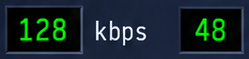

# AmpX UI Visual Checks — ReferenceMeasurementsV1

**Date:** 2026-09-11  
**Source:** `screenshots/AmpX.png` (998×1576 px, 2× retina; logical canvas 499×788 pt, composition 490 pt wide)  
**Tooling:** `cd scripts && uv run python measure_reference.py ../screenshots/AmpX.png`

All content rectangles are in module-local coordinates (origin below the 22 pt header, excluding outer canvas padding). Source-pixel columns are PNG-space (2×) before logical conversion.

## Stack geometry

| Key | Source px (x, y, w, h) | Logical value | Notes |
|---|---|---|---|
| `compositionWidth` | — | 490 | Module column width at scale 1.0 |
| `canvasPadding.left` | x=9 | 4.5 | `(499 − 490) / 2` |
| `canvasPadding.top` | y=22 | 11 | `(788 − 766) / 2` |
| `headerHeight` | 44 | 22 | Gold accent line at ~10.5 pt from module top |
| `moduleGap` | 12 | 6 | Between Player, Equalizer, Playlist |
| `playerHeight` | 447 | 223.5 | Module outer height |
| `equalizerHeight` | 451 | 225.5 | Module outer height |
| `playlistHeight` | 610 | 305 | Module outer height |
| `playlistNonRowChrome` | — | 103 | Header offset + footer; viewport = 180 pt |

## Player (`player.*`)

| Key | Source px (x, y, w, h) | Content rect (x, y, w, h) | Notes |
|---|---|---|---|
| `player.displayWell` | (39, 87, 331, 184) | (15.0, 10.5, 165.5, 92.0) | Timer + spectrum column |
| `player.timer` | (81, 102, 258, 47) | (36.0, 18.0, 129.0, 23.5) | 7-segment timer within display well |
| `player.playGlyph` | (81, 107, 25, 33) | (21.0, 20.5, 12.5, 16.5) | Green play triangle left of timer |
| `player.trackWell` | (388, 88, 571, 56) | (189.5, 11.0, 285.5, 28.0) | Title marquee well |
| `player.metadata` | (388, 159, 233, 43) | (189.5, 46.5, 116.5, 21.5) | kbps / kHz / mono / stereo — see crop below |
| `player.metadata.digitStyle` | — | **mono** | Continuous Roboto Mono glyphs (see justification) |
| `player.volume` | (387, 229, 201, 41) | (189.0, 81.5, 100.5, 20.5) | Volume slider track |
| `player.balance` | (619, 229, 122, 41) | (305.0, 81.5, 61.0, 20.5) | Balance slider track |
| `player.position` | (40, 289, 917, 8) | (15.5, 111.5, 458.5, 4.0) | Full-width seek bar |
| `player.transport[0…8]` | See script output | See `AmpXMetrics.playerTransport` | prev, play, pause, stop, next, eject, shuffle, repeat, menu — 44×38 pt |

### Metadata reference crop

**Digit style justification (`mono` vs `segments`):** The crop shows kbps/kHz/mono labels drawn with continuous monospace font strokes (curved `9`, open `4`, diagonal `k`). The timer in `player.displayWell` uses discrete 7-segment LED bars (horizontal/vertical chunks with dark gutters). Metadata therefore uses `metadataDigitStyle = .mono`; only the timer and spectrum bars stay segment-drawn.

## Equalizer (`eq.*`)

| Key | Source px (x, y, w, h) | Content rect (x, y, w, h) | Notes |
|---|---|---|---|
| `eq.curve` | — | (68.0, 18.0, 314.0, 24.0) | Black well + dotted midline + gradient spline |
| `eq.onToggle` | — | (15.0, 14.0, 26.0, 18.0) | Green indicator active |
| `eq.autoToggle` | — | (43.0, 14.0, 32.0, 18.0) | Gray indicator inactive |
| `eq.presets` | — | (418.0, 14.0, 54.0, 18.0) | Static silhouette |
| `eq.preamp` | — | (15.0, 56.0, 18.0, 120.0) | Vertical track + thumb at 0 dB |
| `eq.bandRow` | — | (34.0, 56.0, 440.0, 120.0) | Ten evenly spaced band tracks |

### EQ reference crop

**Mock band values (`mockBands`, normalized −1…1):** `[0.333, 0.583, 0.167, -0.167, -0.5, -0.583, -0.083, 0.417, 0.667, 0.75]` — derived from reference PNG thumb positions; display-only, not audio settings. Preamp mock = `0.0`. Curve drawn via `AmpXEQBands.responseCurvePoints` + `CatmullRomSpline.path(…).cgPath` translated into `eq.curve` origin.

## Playlist (`playlist.*`)

| Key | Source px (x, y, w, h) | Content rect (x, y, w, h) | Notes |
|---|---|---|---|
| `playlist.rows` | — | (15.5, 9.5, 424.0, 180.0) | Black row viewport |
| `playlist.scrollbar` | — | (440.5, 9.5, 16.0, 180.0) | Gold thumb track |
| `playlist.footer` | — | (15.5, 193.5, 441.0, 89.5) | ADD/REM/SEL/MISC + mini transport |
| `playlist.rowHeight` | — | 22 | Fixed row pitch |
| `playlist.durationColumnWidth` | — | 42 | Right-aligned durations |

## Palette & spectrum

| Key | Value | Source sample | Notes |
|---|---|---|---|
| `gold` | `srgb(0.749, 0.627, 0.322)` | Playlist scrollbar thumb | |
| `goldLight` | `srgb(1.0, 0.953, 0.286)` | Thumb highlight | |
| `spectrum.segmentHeight` | 3.0 pt | L/R analyzer columns | **Frozen override** — PNG median lit run ≈ 2.2 pt (anti-aliased mock peaks); keep Winamp-canonical 3.0 pt |
| `spectrum.segmentGap` | 1.0 pt | L/R analyzer columns below timer | Measured from left analyzer columns (median 2 src px = 1.0 pt) |

### Measurement reconciliation

| Key | Script (raw) | Frozen (`AmpXMetrics`) | Resolution |
|---|---|---|---|
| `player.metadata` | (189.5, 46.5, 116.5, 21.5) | same | Fixed: union bbox of kbps/kHz/mono black wells (`blacks[2]` ∪ `blacks[3]`) |
| `spectrum.segmentGap` | 1.0 pt | 1.0 pt | Fixed: scan L/R columns below timer, not center timer digits |
| `spectrum.segmentHeight` | ~2.2 pt | 3.0 pt | Intentional override — see table above; script prints override to stderr |

## Composition checkpoints (Tasks 6A–6C)

- [x] Task 6A: Player crop — wells, timer segments, mono metadata, transport silhouettes
- [x] Task 6B: Equalizer crop — curve well, preamp, ten band tracks, mock curve
- [ ] Task 6C: Full three-module stack at scale 1.0 and scale bounds

Capture: `./scripts/shoot.sh -- -AmpXNewUI YES`
